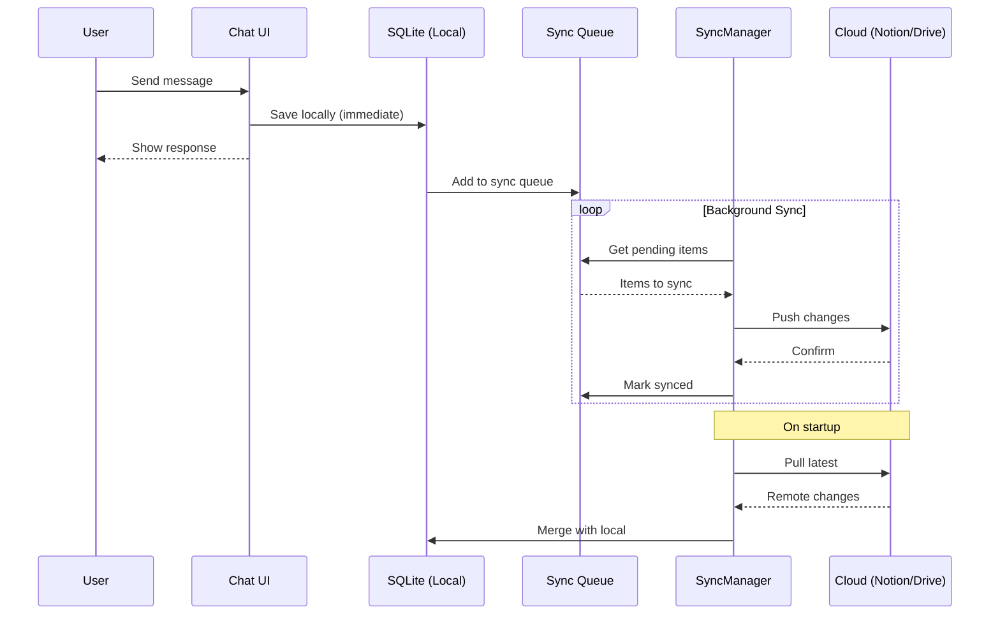

# SCA-01 Hybrid Mode Architecture

> **Version:** 2.0  
> **Status:** APPROVED  
> **Author:** SCA-01 + CLAK  
> **Decision:** Railway (primær) + Notion (integration)

## 1. Executive Summary

SCA-01 kører **lokalt** for maksimal privacy og hastighed, men synkroniserer **historik og state** til cloud for:
- 📱 Multi-device access
- 💾 Backup & recovery
- 🤝 Deling/collaboration
- 📊 Analytics & audit trail

### Beslutning: Railway + Notion

| Komponent | Provider | Formål |
|-----------|----------|--------|
| **Database & API** | Railway (EU) | Sessions, messages, sync |
| **Blackboard** | Notion | HANDOVER_LOG, dokumentation |
| **Lokal** | SQLite | Offline-first, cache |

```
┌─────────────────────────────────────────────────────────────────────┐
│                     SCA-01 HYBRID MODE (v2)                          │
├─────────────────────────────────────────────────────────────────────┤
│                                                                      │
│  ┌─────────────┐    ┌─────────────┐    ┌─────────────┐              │
│  │   Desktop   │    │   Laptop    │    │   Mobile    │              │
│  │   (Win11)   │    │   (Mac)     │    │   (Web)     │              │
│  └──────┬──────┘    └──────┬──────┘    └──────┬──────┘              │
│         │                  │                  │                      │
│         └────────────┬─────┴─────────────────┘                      │
│                      │                                               │
│              ┌───────▼───────┐                                      │
│              │  SYNC LAYER   │                                      │
│              │  - JWT Auth   │                                      │
│              │  - Encryption │                                      │
│              │  - Queue      │                                      │
│              └───────┬───────┘                                      │
│                      │                                               │
│         ┌────────────┴────────────┐                                 │
│         ▼                         ▼                                 │
│  ┌──────────────────┐     ┌──────────────────┐                     │
│  │  🚂 RAILWAY (EU) │     │  📝 NOTION       │                     │
│  │  ┌────────────┐  │     │                  │                     │
│  │  │ Fastify API│  │     │  - HANDOVER_LOG  │                     │
│  │  └─────┬──────┘  │     │  - Blackboard    │                     │
│  │        │         │     │  - Dokumentation │                     │
│  │  ┌─────▼──────┐  │     │                  │                     │
│  │  │ PostgreSQL │  │     └──────────────────┘                     │
│  │  │ (sessions) │  │                                              │
│  │  └────────────┘  │                                              │
│  └──────────────────┘                                              │
│                                                                      │
└─────────────────────────────────────────────────────────────────────┘
```

---

## 1.1 Railway + Notion Split

| Data Type | Storage | Reason |
|-----------|---------|--------|
| **Chat sessions** | Railway PostgreSQL | Structured, queryable, fast |
| **Messages** | Railway PostgreSQL | Relational, indexes |
| **Settings** | Railway PostgreSQL | User preferences |
| **HANDOVER_LOG** | Notion | Eksisterende workflow |
| **Blackboard docs** | Notion | Human-readable, shareable |
| **Audit trail** | Railway PostgreSQL | Compliance, immutable |
| **Tool executions** | Railway PostgreSQL | Analytics, debugging |

---

## 2. Valgt Arkitektur: Railway + Notion

### 2.1 Railway (Primær Backend)

| Aspect | Details |
|--------|---------|
| **Region** | EU (Frankfurt) - GDPR compliant |
| **Database** | PostgreSQL 15 (managed) |
| **API** | Fastify (Phase 3 kode) |
| **Auth** | JWT med refresh tokens |
| **Pris** | ~$5-10/mo (hobby tier) |
| **Uptime** | 99.9% SLA |

**Railway Services:**
```
📦 Railway Project: sca-01-cloud
├── 🚀 Service: sca-01-api (Fastify)
│   ├── PORT: 3000
│   ├── JWT_SECRET: [encrypted]
│   └── DATABASE_URL: [auto]
│
└── 🗄️ Database: PostgreSQL
    ├── sessions
    ├── messages
    ├── users
    ├── settings
    └── audit_log
```

**PostgreSQL Schema:**
```sql
-- Users (for multi-device)
CREATE TABLE users (
  id UUID PRIMARY KEY DEFAULT gen_random_uuid(),
  email TEXT UNIQUE,
  password_hash TEXT,
  created_at TIMESTAMPTZ DEFAULT NOW()
);

-- Sessions (chat conversations)
CREATE TABLE sessions (
  id UUID PRIMARY KEY DEFAULT gen_random_uuid(),
  user_id UUID REFERENCES users(id),
  title TEXT NOT NULL,
  model TEXT DEFAULT 'qwen3',
  system_prompt TEXT,
  created_at TIMESTAMPTZ DEFAULT NOW(),
  updated_at TIMESTAMPTZ DEFAULT NOW(),
  synced_to_notion BOOLEAN DEFAULT FALSE,
  notion_page_id TEXT
);

-- Messages
CREATE TABLE messages (
  id UUID PRIMARY KEY DEFAULT gen_random_uuid(),
  session_id UUID REFERENCES sessions(id) ON DELETE CASCADE,
  role TEXT CHECK (role IN ('user', 'assistant', 'system', 'tool')),
  content TEXT,
  tool_calls JSONB,
  tool_name TEXT,
  created_at TIMESTAMPTZ DEFAULT NOW()
);

-- Audit log (immutable)
CREATE TABLE audit_log (
  id BIGSERIAL PRIMARY KEY,
  user_id UUID REFERENCES users(id),
  action TEXT NOT NULL,
  resource TEXT,
  details JSONB,
  ip_address INET,
  created_at TIMESTAMPTZ DEFAULT NOW()
);

-- Indexes
CREATE INDEX idx_sessions_user ON sessions(user_id);
CREATE INDEX idx_messages_session ON messages(session_id);
CREATE INDEX idx_audit_user ON audit_log(user_id, created_at);
```

### 2.2 Notion (Blackboard Integration)

| Aspect | Details |
|--------|---------|
| **Formål** | HANDOVER_LOG, dokumentation, blackboard |
| **Sync** | Bi-directional (Railway ↔ Notion) |
| **Trigger** | Session complete → create Notion page |
| **Auth** | OAuth 2.0 integration |

**Notion Integration Flow:**
```
┌─────────────────────────────────────────────────────────────┐
│                NOTION INTEGRATION                            │
├─────────────────────────────────────────────────────────────┤
│                                                              │
│  ┌─────────────┐         ┌─────────────┐                    │
│  │   Railway   │         │   Notion    │                    │
│  │  PostgreSQL │────────▶│  Database   │                    │
│  └─────────────┘         └─────────────┘                    │
│         │                       │                            │
│         │ On session complete   │                            │
│         ▼                       ▼                            │
│  ┌─────────────┐         ┌─────────────┐                    │
│  │ Session     │────────▶│ Notion Page │                    │
│  │ Summary     │         │ with blocks │                    │
│  └─────────────┘         └─────────────┘                    │
│                                                              │
│  📝 HANDOVER_LOG.md ◀──────────────────▶ Notion Database    │
│                                                              │
└─────────────────────────────────────────────────────────────┘
```

**Notion Database: "SCA-01 Sessions"**
```
📊 Properties:
├── Title (title)
├── Status (select: Active, Completed, Archived)
├── Model (select: qwen3, llama3.1, etc.)
├── Messages (number)
├── Created (date)
├── Updated (date)
├── Railway ID (text) - link back to PostgreSQL
└── Tags (multi-select)
```

**Notion Page Template:**
```markdown
# Session: {title}

**Model:** {model}
**Created:** {date}
**Status:** {status}

## System Prompt
{system_prompt}

## Conversation
> 👤 **User:** {message}
> ⚡ **Assistant:** {response}
> 🔧 **Tool Call:** {tool_name}({args})

## Executive Summary
{auto-generated summary}

## Next Steps
- [ ] {suggested actions}
```

---

## 3. Legacy Provider Options (Reference)

### 3.1 Notion (Standalone - NOT USED)

| Aspect | Details |
|--------|---------|
| **Pros** | Struktureret data, eksisterende workflow, god UI |
| **Cons** | US-based (Schrems II), rate limits (3 req/s) |
| **Data Model** | Database → Sessions, Pages → Chats |
| **Auth** | OAuth 2.0 integration |
| **Encryption** | Optional client-side |

**Notion Database Schema:**
```
📁 SCA-01 Sessions (Database)
├── Session ID (title)
├── Created (date)
├── Updated (date)
├── Model (select)
├── Message Count (number)
├── Status (select: active/archived)
└── 📄 Session Page
    ├── System Prompt (text block)
    └── Messages (toggle blocks)
        ├── 👤 User: "..."
        ├── ⚡ Assistant: "..."
        └── 🔧 Tool Call: {...}
```

### 2.2 Google Drive

| Aspect | Details |
|--------|---------|
| **Pros** | Stort storage, familiar, god offline |
| **Cons** | US-based, file-based (ikke queryable) |
| **Data Model** | Folder hierarchy med JSON files |
| **Auth** | OAuth 2.0 + refresh tokens |
| **Encryption** | Anbefalet client-side |

**Folder Structure:**
```
📁 SCA-01/
├── 📁 sessions/
│   ├── session-2026-01-01-abc123.json
│   ├── session-2026-01-02-def456.json
│   └── ...
├── 📁 settings/
│   └── config.json
├── 📁 attachments/
│   └── ...
└── 📄 sync-state.json
```

### 2.3 Supabase (EU - GDPR Compliant)

| Aspect | Details |
|--------|---------|
| **Pros** | EU-hosted, PostgreSQL, realtime sync |
| **Cons** | Kræver setup, ekstra service |
| **Data Model** | Relational tables |
| **Auth** | Supabase Auth (email/OAuth) |
| **Encryption** | Row-level security + optional |

**Database Schema:**
```sql
CREATE TABLE sessions (
  id UUID PRIMARY KEY,
  user_id UUID REFERENCES auth.users,
  title TEXT,
  model TEXT,
  system_prompt TEXT,
  created_at TIMESTAMPTZ,
  updated_at TIMESTAMPTZ
);

CREATE TABLE messages (
  id UUID PRIMARY KEY,
  session_id UUID REFERENCES sessions,
  role TEXT CHECK (role IN ('user', 'assistant', 'tool')),
  content TEXT,
  tool_calls JSONB,
  created_at TIMESTAMPTZ
);
```

---

## 3. Sync Architecture

### 3.1 Offline-First Design

```
┌─────────────────────────────────────────────────────────────┐
│                    LOCAL (Primary)                           │
├─────────────────────────────────────────────────────────────┤
│                                                              │
│  ┌─────────────┐    ┌─────────────┐    ┌─────────────┐      │
│  │   Chat UI   │───▶│   SQLite    │───▶│ Sync Queue  │      │
│  │             │    │   (local)   │    │             │      │
│  └─────────────┘    └─────────────┘    └──────┬──────┘      │
│                                               │              │
│                                               ▼              │
│                                        ┌─────────────┐      │
│                                        │ SyncManager │      │
│                                        └──────┬──────┘      │
│                                               │              │
└───────────────────────────────────────────────┼──────────────┘
                                                │
                                                ▼ (when online)
┌─────────────────────────────────────────────────────────────┐
│                    CLOUD (Secondary)                         │
├─────────────────────────────────────────────────────────────┤
│  ┌─────────────┐    ┌─────────────┐    ┌─────────────┐      │
│  │   Notion    │    │   Google    │    │  Supabase   │      │
│  │   Adapter   │    │   Adapter   │    │   Adapter   │      │
│  └─────────────┘    └─────────────┘    └─────────────┘      │
└─────────────────────────────────────────────────────────────┘
```

### 3.2 Sync Flow



### 3.3 Conflict Resolution

| Scenario | Resolution |
|----------|------------|
| Same session edited on 2 devices | **Last-write-wins** (by timestamp) |
| New messages on both | **Merge** (append both, sort by time) |
| Settings conflict | **Local wins** (user's current device) |
| Deleted on one, edited on other | **Prompt user** |

---

## 4. Security & Compliance

### 4.1 Encryption Layer (Optional but Recommended)

```typescript
interface EncryptionConfig {
  enabled: boolean;
  algorithm: 'aes-256-gcm';
  keyDerivation: 'pbkdf2' | 'argon2';
  keySource: 'password' | 'keyfile' | 'hardware';
}

// Data is encrypted BEFORE leaving the device
const encrypted = await encrypt(sessionData, userKey);
await cloudAdapter.upload(encrypted);

// Decrypted AFTER download
const encrypted = await cloudAdapter.download(id);
const sessionData = await decrypt(encrypted, userKey);
```

### 4.2 GDPR/Schrems II Considerations

| Provider | Data Location | DPA | Recommendation |
|----------|---------------|-----|----------------|
| Notion | US | Yes | ⚠️ Use encryption |
| Google Drive | US/EU | Yes | ⚠️ Use encryption |
| Supabase EU | EU | Yes | ✅ Preferred |
| Self-hosted | Your control | N/A | ✅ Best compliance |

### 4.3 Token Security

```typescript
// Tokens stored encrypted in system keychain
import keytar from 'keytar';

await keytar.setPassword('sca-01', 'notion-token', encryptedToken);
const token = await keytar.getPassword('sca-01', 'notion-token');
```

---

## 5. Implementation Plan

### Phase 2.5: Hybrid Mode - Railway + Notion (5 Sprints)

#### Sprint 1: Local Persistence (Week 1)
- [ ] Migrate from `electron-store` to `better-sqlite3`
- [ ] Define schema (sessions, messages, settings, audit)
- [ ] Implement local CRUD operations
- [ ] Add migration system

**Deliverables:**
- `src/db/schema.ts`
- `src/db/LocalStore.ts`
- `src/db/migrations/`

#### Sprint 2: Railway Backend (Week 2)
- [ ] Deploy Phase 3 til Railway
- [ ] Setup PostgreSQL database
- [ ] Implement user auth (register/login)
- [ ] Add session CRUD endpoints
- [ ] Add message endpoints

**Deliverables:**
- Railway project setup
- `src/server/routes/sessions.ts`
- `src/server/routes/messages.ts`
- `src/server/routes/auth.ts`

#### Sprint 3: Desktop ↔ Railway Sync (Week 3)
- [ ] Implement `RailwayAdapter`
- [ ] Background sync worker
- [ ] Conflict resolution (last-write-wins)
- [ ] Offline queue with retry

**Deliverables:**
- `src/sync/RailwayAdapter.ts`
- `src/sync/SyncManager.ts`
- `src/sync/OfflineQueue.ts`

#### Sprint 4: Notion Integration (Week 4)
- [ ] Notion OAuth flow in Electron
- [ ] Create `NotionAdapter` for blackboard
- [ ] Sync HANDOVER_LOG bi-directionally
- [ ] Auto-create Notion pages on session complete

**Deliverables:**
- `src/sync/NotionAdapter.ts`
- `src/auth/NotionOAuth.ts`
- `src/notion/BlackboardSync.ts`

#### Sprint 5: UI Integration (Week 5)
- [ ] Sync status indicator i header
- [ ] Settings: Railway + Notion config
- [ ] Login/register UI
- [ ] Conflict resolution UI

**Deliverables:**
- Updated `chat.html` with sync UI
- `src/ui/auth/LoginView.ts`
- `src/ui/sync/SyncStatus.ts`

---

### Railway Deployment Checklist

```bash
# 1. Install Railway CLI
npm install -g @railway/cli

# 2. Login
railway login

# 3. Create project
railway init

# 4. Add PostgreSQL
railway add --plugin postgresql

# 5. Deploy
cd sca-01-phase3
railway up

# 6. Set environment variables
railway variables set JWT_SECRET=$(openssl rand -base64 32)
railway variables set NODE_ENV=production

# 7. Get public URL
railway domain
```

**Estimated cost:** ~$5-10/month for hobby usage

---

## 6. UI Integration

### Settings → Cloud Sync

```
┌─────────────────────────────────────────────┐
│ ☁️ Cloud Sync                               │
├─────────────────────────────────────────────┤
│                                             │
│ Provider:  [▼ Notion    ]                   │
│                                             │
│ Status:    🟢 Synced (2 min ago)            │
│                                             │
│ ┌─────────────────────────────────────────┐ │
│ │ 📊 Sync Stats                           │ │
│ │ Sessions: 47 synced                     │ │
│ │ Messages: 1,234 synced                  │ │
│ │ Last sync: 2026-01-01 20:45            │ │
│ └─────────────────────────────────────────┘ │
│                                             │
│ [🔄 Sync Now]  [⚙️ Configure]  [🔌 Disconnect] │
│                                             │
│ ☐ Enable client-side encryption            │
│ ☐ Sync attachments                         │
│ ☐ Auto-sync every 5 minutes                │
│                                             │
└─────────────────────────────────────────────┘
```

### Sync Status Indicator (Header)

```
┌──────────────────────────────────────┐
│ qwen3 ▼   │  🔌 3 MCP  │  ☁️ ● Synced │
└──────────────────────────────────────┘
```

---

## 7. API Reference

### CloudAdapter Interface

```typescript
interface CloudAdapter {
  // Connection
  connect(credentials: Credentials): Promise<void>;
  disconnect(): Promise<void>;
  isConnected(): boolean;

  // Sessions
  listSessions(): Promise<SessionMeta[]>;
  getSession(id: string): Promise<Session>;
  saveSession(session: Session): Promise<void>;
  deleteSession(id: string): Promise<void>;

  // Sync
  getLastSyncTime(): Promise<Date | null>;
  getChangedSince(since: Date): Promise<ChangeSet>;
  applyChanges(changes: ChangeSet): Promise<void>;
}

interface ChangeSet {
  sessions: { added: Session[]; updated: Session[]; deleted: string[] };
  messages: { added: Message[]; updated: Message[]; deleted: string[] };
  timestamp: Date;
}
```

---

## 8. Risks & Mitigations

| Risk | Impact | Mitigation |
|------|--------|------------|
| Cloud provider outage | Can't sync | Offline-first design |
| Rate limiting (Notion) | Slow sync | Queue + exponential backoff |
| Data corruption | Data loss | Checksums + versioning |
| Token theft | Unauthorized access | Keychain + encryption |
| Schrems II violation | Legal issues | Client-side encryption |

---

## 9. Decision Log

### ✅ BESLUTTET: Railway (primær) + Notion (integration)

| Beslutning | Valg | Begrundelse |
|------------|------|-------------|
| **Primær backend** | Railway (EU) | GDPR compliant, billig, nem deploy |
| **Database** | PostgreSQL | Structured, queryable, reliable |
| **Blackboard** | Notion | Eksisterende workflow, human-readable |
| **Auth** | JWT + refresh | Stateless, skalerbar |
| **Encryption** | Optional (anbefalet) | User choice for extra security |

### Åbne spørgsmål

1. **Multi-user?** - Skal flere brugere kunne dele sessions?
2. **Team features?** - Shared workspaces i Notion?
3. **Audit retention?** - Hvor længe gemmes audit logs?

---

## 10. Summary

```
┌─────────────────────────────────────────────────────────────┐
│                 SCA-01 HYBRID STACK                          │
├─────────────────────────────────────────────────────────────┤
│                                                              │
│  LOCAL                  RAILWAY (EU)         NOTION          │
│  ┌─────────┐           ┌─────────┐          ┌─────────┐     │
│  │ SQLite  │◀─────────▶│PostgreSQL│─────────▶│Blackboard│    │
│  │ Cache   │   Sync    │ Primary │  Export  │ Docs     │    │
│  └─────────┘           └─────────┘          └─────────┘     │
│                                                              │
│  ✅ Offline-first      ✅ GDPR EU           ✅ Workflow     │
│  ✅ Fast               ✅ $5/mo             ✅ Shareable    │
│  ✅ Private            ✅ Scalable          ✅ Human-read   │
│                                                              │
└─────────────────────────────────────────────────────────────┘
```

> **Restrisiko:** Lav. Offline-first sikrer drift uden cloud. Railway EU region sikrer GDPR compliance. Notion bruges kun til non-sensitive blackboard docs.

**Status:** ✅ APPROVED - READY FOR IMPLEMENTATION

