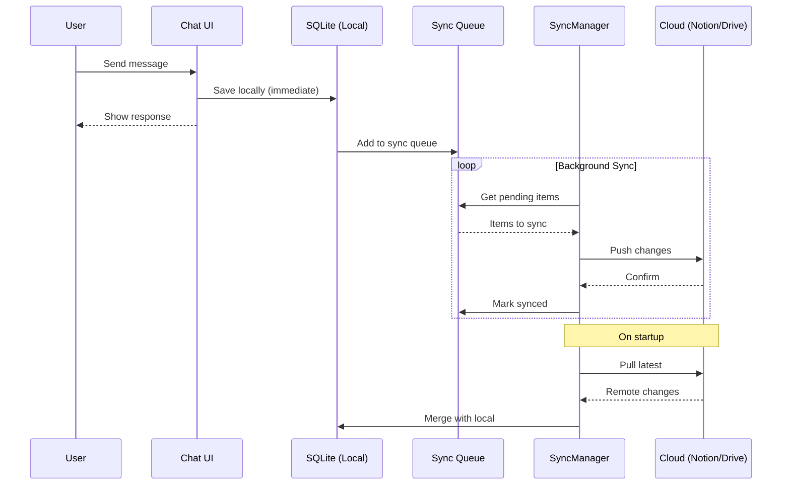

# SCA-01 Hybrid Mode Architecture

> **Version:** 1.0  
> **Status:** PROPOSED  
> **Author:** SCA-01 + CLAK  

## 1. Executive Summary

SCA-01 kører **lokalt** for maksimal privacy og hastighed, men synkroniserer **historik og state** til cloud for:
- 📱 Multi-device access
- 💾 Backup & recovery
- 🤝 Deling/collaboration
- 📊 Analytics & audit trail

```
┌─────────────────────────────────────────────────────────────┐
│                     SCA-01 HYBRID MODE                       │
├─────────────────────────────────────────────────────────────┤
│                                                              │
│  ┌─────────────┐    ┌─────────────┐    ┌─────────────┐      │
│  │   Desktop   │    │   Laptop    │    │   Mobile    │      │
│  │   (Win11)   │    │   (Mac)     │    │   (Web?)    │      │
│  └──────┬──────┘    └──────┬──────┘    └──────┬──────┘      │
│         │                  │                  │              │
│         └────────────┬─────┴─────────────────┘              │
│                      │                                       │
│              ┌───────▼───────┐                              │
│              │  SYNC LAYER   │                              │
│              │  - Encryption │                              │
│              │  - Conflict   │                              │
│              │  - Queue      │                              │
│              └───────┬───────┘                              │
│                      │                                       │
│         ┌────────────┼────────────┐                         │
│         ▼            ▼            ▼                         │
│  ┌──────────┐ ┌──────────┐ ┌──────────┐                    │
│  │  Notion  │ │  Google  │ │ Supabase │                    │
│  │   API    │ │  Drive   │ │   (EU)   │                    │
│  └──────────┘ └──────────┘ └──────────┘                    │
│                                                              │
└─────────────────────────────────────────────────────────────┘
```

---

## 2. Cloud Provider Options

### 2.1 Notion (Recommended for CLAK workflow)

| Aspect | Details |
|--------|---------|
| **Pros** | Struktureret data, eksisterende workflow, god UI |
| **Cons** | US-based (Schrems II), rate limits (3 req/s) |
| **Data Model** | Database → Sessions, Pages → Chats |
| **Auth** | OAuth 2.0 integration |
| **Encryption** | Optional client-side |

**Notion Database Schema:**
```
📁 SCA-01 Sessions (Database)
├── Session ID (title)
├── Created (date)
├── Updated (date)
├── Model (select)
├── Message Count (number)
├── Status (select: active/archived)
└── 📄 Session Page
    ├── System Prompt (text block)
    └── Messages (toggle blocks)
        ├── 👤 User: "..."
        ├── ⚡ Assistant: "..."
        └── 🔧 Tool Call: {...}
```

### 2.2 Google Drive

| Aspect | Details |
|--------|---------|
| **Pros** | Stort storage, familiar, god offline |
| **Cons** | US-based, file-based (ikke queryable) |
| **Data Model** | Folder hierarchy med JSON files |
| **Auth** | OAuth 2.0 + refresh tokens |
| **Encryption** | Anbefalet client-side |

**Folder Structure:**
```
📁 SCA-01/
├── 📁 sessions/
│   ├── session-2026-01-01-abc123.json
│   ├── session-2026-01-02-def456.json
│   └── ...
├── 📁 settings/
│   └── config.json
├── 📁 attachments/
│   └── ...
└── 📄 sync-state.json
```

### 2.3 Supabase (EU - GDPR Compliant)

| Aspect | Details |
|--------|---------|
| **Pros** | EU-hosted, PostgreSQL, realtime sync |
| **Cons** | Kræver setup, ekstra service |
| **Data Model** | Relational tables |
| **Auth** | Supabase Auth (email/OAuth) |
| **Encryption** | Row-level security + optional |

**Database Schema:**
```sql
CREATE TABLE sessions (
  id UUID PRIMARY KEY,
  user_id UUID REFERENCES auth.users,
  title TEXT,
  model TEXT,
  system_prompt TEXT,
  created_at TIMESTAMPTZ,
  updated_at TIMESTAMPTZ
);

CREATE TABLE messages (
  id UUID PRIMARY KEY,
  session_id UUID REFERENCES sessions,
  role TEXT CHECK (role IN ('user', 'assistant', 'tool')),
  content TEXT,
  tool_calls JSONB,
  created_at TIMESTAMPTZ
);
```

---

## 3. Sync Architecture

### 3.1 Offline-First Design

```
┌─────────────────────────────────────────────────────────────┐
│                    LOCAL (Primary)                           │
├─────────────────────────────────────────────────────────────┤
│                                                              │
│  ┌─────────────┐    ┌─────────────┐    ┌─────────────┐      │
│  │   Chat UI   │───▶│   SQLite    │───▶│ Sync Queue  │      │
│  │             │    │   (local)   │    │             │      │
│  └─────────────┘    └─────────────┘    └──────┬──────┘      │
│                                               │              │
│                                               ▼              │
│                                        ┌─────────────┐      │
│                                        │ SyncManager │      │
│                                        └──────┬──────┘      │
│                                               │              │
└───────────────────────────────────────────────┼──────────────┘
                                                │
                                                ▼ (when online)
┌─────────────────────────────────────────────────────────────┐
│                    CLOUD (Secondary)                         │
├─────────────────────────────────────────────────────────────┤
│  ┌─────────────┐    ┌─────────────┐    ┌─────────────┐      │
│  │   Notion    │    │   Google    │    │  Supabase   │      │
│  │   Adapter   │    │   Adapter   │    │   Adapter   │      │
│  └─────────────┘    └─────────────┘    └─────────────┘      │
└─────────────────────────────────────────────────────────────┘
```

### 3.2 Sync Flow



### 3.3 Conflict Resolution

| Scenario | Resolution |
|----------|------------|
| Same session edited on 2 devices | **Last-write-wins** (by timestamp) |
| New messages on both | **Merge** (append both, sort by time) |
| Settings conflict | **Local wins** (user's current device) |
| Deleted on one, edited on other | **Prompt user** |

---

## 4. Security & Compliance

### 4.1 Encryption Layer (Optional but Recommended)

```typescript
interface EncryptionConfig {
  enabled: boolean;
  algorithm: 'aes-256-gcm';
  keyDerivation: 'pbkdf2' | 'argon2';
  keySource: 'password' | 'keyfile' | 'hardware';
}

// Data is encrypted BEFORE leaving the device
const encrypted = await encrypt(sessionData, userKey);
await cloudAdapter.upload(encrypted);

// Decrypted AFTER download
const encrypted = await cloudAdapter.download(id);
const sessionData = await decrypt(encrypted, userKey);
```

### 4.2 GDPR/Schrems II Considerations

| Provider | Data Location | DPA | Recommendation |
|----------|---------------|-----|----------------|
| Notion | US | Yes | ⚠️ Use encryption |
| Google Drive | US/EU | Yes | ⚠️ Use encryption |
| Supabase EU | EU | Yes | ✅ Preferred |
| Self-hosted | Your control | N/A | ✅ Best compliance |

### 4.3 Token Security

```typescript
// Tokens stored encrypted in system keychain
import keytar from 'keytar';

await keytar.setPassword('sca-01', 'notion-token', encryptedToken);
const token = await keytar.getPassword('sca-01', 'notion-token');
```

---

## 5. Implementation Plan

### Phase 2.5: Hybrid Mode (4 Sprints)

#### Sprint 1: Local Persistence (Week 1)
- [ ] Migrate from `electron-store` to `better-sqlite3`
- [ ] Define schema (sessions, messages, settings, audit)
- [ ] Implement local CRUD operations
- [ ] Add migration system

**Deliverables:**
- `src/db/schema.ts`
- `src/db/LocalStore.ts`
- `src/db/migrations/`

#### Sprint 2: Sync Infrastructure (Week 2)
- [ ] Define `CloudAdapter` interface
- [ ] Implement `SyncManager` with queue
- [ ] Add conflict resolution logic
- [ ] Optional encryption layer

**Deliverables:**
- `src/sync/CloudAdapter.ts`
- `src/sync/SyncManager.ts`
- `src/sync/EncryptionService.ts`

#### Sprint 3: Notion Adapter (Week 3)
- [ ] Implement OAuth flow in Electron
- [ ] Create `NotionAdapter`
- [ ] Background sync worker
- [ ] Rate limiting & retry logic

**Deliverables:**
- `src/sync/adapters/NotionAdapter.ts`
- `src/auth/NotionOAuth.ts`

#### Sprint 4: Google Drive Adapter (Week 4)
- [ ] Implement Google OAuth
- [ ] Create `DriveAdapter`
- [ ] File-based storage logic
- [ ] Folder structure management

**Deliverables:**
- `src/sync/adapters/DriveAdapter.ts`
- `src/auth/GoogleOAuth.ts`

---

## 6. UI Integration

### Settings → Cloud Sync

```
┌─────────────────────────────────────────────┐
│ ☁️ Cloud Sync                               │
├─────────────────────────────────────────────┤
│                                             │
│ Provider:  [▼ Notion    ]                   │
│                                             │
│ Status:    🟢 Synced (2 min ago)            │
│                                             │
│ ┌─────────────────────────────────────────┐ │
│ │ 📊 Sync Stats                           │ │
│ │ Sessions: 47 synced                     │ │
│ │ Messages: 1,234 synced                  │ │
│ │ Last sync: 2026-01-01 20:45            │ │
│ └─────────────────────────────────────────┘ │
│                                             │
│ [🔄 Sync Now]  [⚙️ Configure]  [🔌 Disconnect] │
│                                             │
│ ☐ Enable client-side encryption            │
│ ☐ Sync attachments                         │
│ ☐ Auto-sync every 5 minutes                │
│                                             │
└─────────────────────────────────────────────┘
```

### Sync Status Indicator (Header)

```
┌──────────────────────────────────────┐
│ qwen3 ▼   │  🔌 3 MCP  │  ☁️ ● Synced │
└──────────────────────────────────────┘
```

---

## 7. API Reference

### CloudAdapter Interface

```typescript
interface CloudAdapter {
  // Connection
  connect(credentials: Credentials): Promise<void>;
  disconnect(): Promise<void>;
  isConnected(): boolean;

  // Sessions
  listSessions(): Promise<SessionMeta[]>;
  getSession(id: string): Promise<Session>;
  saveSession(session: Session): Promise<void>;
  deleteSession(id: string): Promise<void>;

  // Sync
  getLastSyncTime(): Promise<Date | null>;
  getChangedSince(since: Date): Promise<ChangeSet>;
  applyChanges(changes: ChangeSet): Promise<void>;
}

interface ChangeSet {
  sessions: { added: Session[]; updated: Session[]; deleted: string[] };
  messages: { added: Message[]; updated: Message[]; deleted: string[] };
  timestamp: Date;
}
```

---

## 8. Risks & Mitigations

| Risk | Impact | Mitigation |
|------|--------|------------|
| Cloud provider outage | Can't sync | Offline-first design |
| Rate limiting (Notion) | Slow sync | Queue + exponential backoff |
| Data corruption | Data loss | Checksums + versioning |
| Token theft | Unauthorized access | Keychain + encryption |
| Schrems II violation | Legal issues | Client-side encryption |

---

## 9. Decision Required

**Anbefaling:** Start med **Notion** (matcher eksisterende workflow), men byg adapter-interface så andre providers nemt kan tilføjes.

**Spørgsmål til CLAK:**
1. Skal encryption være mandatory eller optional?
2. Foretrækker du Notion eller Google Drive først?
3. Skal vi overveje Supabase EU for bedre compliance?
4. Ønskes multi-user/sharing support?

---

> **Restrisiko:** Lav. Offline-first sikrer drift uden cloud. Encryption mitigerer compliance-risiko ved US-providers.

**Status:** READY FOR REVIEW

